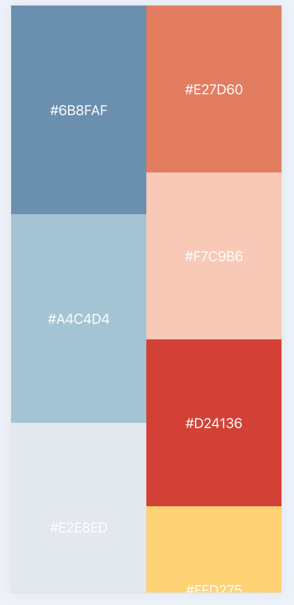
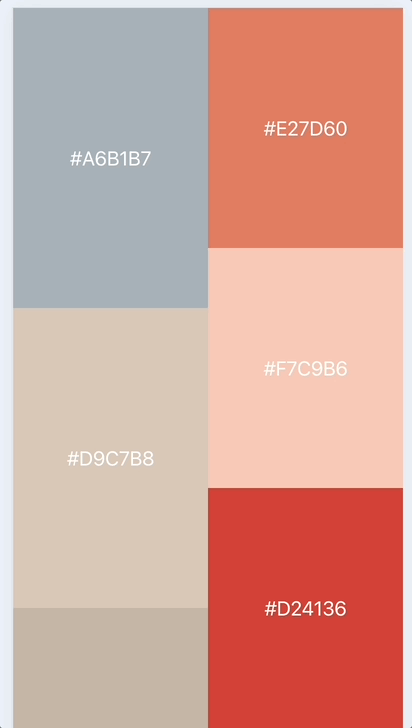

+++
date = '2025-05-28T11:20:13+08:00'
draft = false
title = 'Pull to Refresh | 下拉刷新'
[[resources]]
  name = 'waterfall'
  src = 'images/waterfall-h5.png'
+++


下拉刷新大概是我们日常使用手机时最常做的一个操作，为了消解无聊，在各个App间频繁切换（无一例外这些App都采用了瀑布流），上滑、下滑，试图用信息把头脑填满。

那么如何实现这个看似简单的功能呢。

正式开始前，我们需要做一点准备工作。

首先，我们得有一个瀑布流。

```jsx {linenos=inline}
function Waterfall() {
  const [l1, setL1] = useState([]);
  const [l2, setL2] = useState([]);
  const startQuery = async () => {
    const [l1, l2] = await Promise.all([
      fetch('http://localhost:3000/list').then(res => res.json()),
      fetch('http://localhost:3000/list').then(res => res.json()),
    ])
    setL1(l1);
    setL2(l2);
  }
  
  useEffect(() => {
    startQuery();
  }, []);
  return (
    <div className="h-screen w-full grid grid-cols-2">
      <div className="w-full flex flex-col justify-start items-center">
        {l1.map(color => <Card color={color} />)}
      </div>
      <div className="w-full flex flex-col justify-start items-center">
        {l2.map(color => <Card color={color} />)}
      </div>
    </div> 
  )
}
```

这里我用nest在本地启了一个node服务，接口会返回一串随机的颜色，像`['#ffffff', '#000000', ...]`这样，并有一个额外的delay用来模拟网络延迟。

页面使用`grid`布局，左边一列对应l1, 右边对应l2。

Card组件本身是一个div，bg-color用外部传入的值。

这样我们就得到了一个类似小红书的瀑布流。



现在这个页面是一个纯静态的页面，没有任何交互，无法重新拉取数据（除非点击浏览器的刷新按钮）。

让我们来为页面增加`pull-to-refresh`特性。

```jsx {linenos=inline}
function PullToRefresh({ children, onRefresh }) {
  const startY = useRef(0);
  const [pulling, setPulling] = useState(false);
  const [translateY, setTranslateY] = useState(0);

  const handleTouchStart = (e) => {
    if (window.scrollY === 0) {
      startY.current = e.touches[0].clientY;
      setPulling(true);
    }
  };

  const handleTouchMove = (e) => {
    if (!pulling) return;
    const deltaY = e.touches[0].clientY - starty.current;
    if (deltaY > 0) {
      setTranslateY(Math.min(deltaY, 100));
    }
  };

  const handleTouchEnd = () => {
    if (translateY > 80) {
      onRefresh();
    }
    setTranslateY();
    setPulling(false);
  };
  return (
    <div
      onTouchStart={onTouchStart}
      onTouchMove={onTouchMove}
      onTouchEnd={onTouchEnd}
      className="w-full"
      style={{
        transform: `translateY(${translateY}px)`,
        transition: pulling ? 'none' : 'transform 0.3s ease',
      }}
    >
      {children}
    </div>
  )
}
```

这里，我们在`div`容器上绑定了三个事件：`touchstart`、`touchmove`、`touchend`，用来监听下拉刷新这一动作，在`touchstart`里，首先判断页面是否位于顶部，然后在`touchmove`中记录向下移动的距离，并把值存在`translateY`这个状态上，通过`div`容器上的`transform: translateY`样式实现页面的下拉效果。在`touchend`里，判断最终下拉的距离是否大于某个值，这里我们暂定为`80px`，如果条件满足，就调用传入的onRefresh方法。

现在，让我们把瀑布流外面套上这个`PullToRefresh`组件，看看效果。

```jsx {linenos=inline hl_lines=[2, 4, 6, "9-12", 21]}
function Waterfall() {
  const [loading, setLoading] = useState(false);
  const startQuery = () => {
    setLoading(true);
    // ...中间部分省略
    setLoading(false);
  }
  return (
    <PullToRefresh
      onRefresh={startQuery}
    >
      {loading && <Spinner />}
      <div className="h-screen w-full grid grid-cols-2">
        <div className="w-full flex flex-col justify-start items-center">
          {l1.map(color => <Card color={color} />)}
        </div>
        <div className="w-full flex flex-col justify-start items-center">
          {l2.map(color => <Card color={color} />)}
        </div>
      </div> 
    </PullToRefresh>
  )
}
```

为了体现加载过程，这里特意加了一个`Spinner`组件。



效果似乎还可以，但看起来比较简陋，仍有可以改进的空间。

比如，有的App会把`Spinner`放在下拉出现的空白中，在数据刷新后，才会消失。

还有的App在下拉时，页面本身不会移动，而是从页面上方出现一个`Spinner`，配合上动画，效果如同真的被拉下来一样，像那种通过拉绳控制开关的老式吊灯。

让我们改造一下`PullToRefresh`，以实现第一种效果。

```jsx {linenos=inline hl_lines=[5, 11, "14-19", 23, "36-45"]}
function PullToRefresh({ children, onRefresh }) {
  const startY = useRef(0);
  const [pulling, setPulling] = useState(false);
  const [translateY, setTranslateY] = useState(0);
  const [loading, setLoading] = useState(false);

  const handleTouchStart = (e) => {/* stay same */};

  const handleTouchMove = (e) => {/* stay same */};

  const handleTouchEnd = async () => {
    setLoading(true);
    if (translateY >= 100) {
      try {
        setTranslateY(80);
        await onRefresh();
      } catch(err) {
        // handling error here
      }
    }
    setTranslateY(0);
    setPulling(false);
    setLoading(false);
  };
  return (
    <div
      onTouchStart={onTouchStart}
      onTouchMove={onTouchMove}
      onTouchEnd={onTouchEnd}
      className="w-full"
      style={{
        transform: `translateY(${translateY}px)`,
        transition: pulling ? 'none' : 'transform 0.3s ease',
      }}
    >
      {(translateY > 0 || loading) && (
        <div
          className="w-full flex items-center justify-center asbolute overflow-hidden"
          style={{
            height: `${translateY}px`,
            top: `-${translateY}px`,
          }}
        >
          <Spinner />
        </div>
      )}
      {children}
    </div>
  )
}
```
改造后，我们把`Spinner`从页面上拿到了`PullToRefresh`里面（一个附加好处是不用给每个页面单独增加loading效果了），这里要注意一下包裹`Spinner`的`div`容器的样式。

看一下改造后的效果：


比上一版好不少，不是吗。

以上，就是一个简单的`PullToRefresh`的实现，希望对你（还有我）有所启发 ———— 但是且慢 ———— 我们这个实现有一个很大的缺陷 ———— 无法在pc端使用！因为它是通过一系列`touch`事件的组合来实现的，因此只能在移动端生效。

如果你的应用需要同时支持多端，还是应当借助[better-scroll](https://github.com/ustbhuangyi/better-scroll)这样的库来实现。（End）
