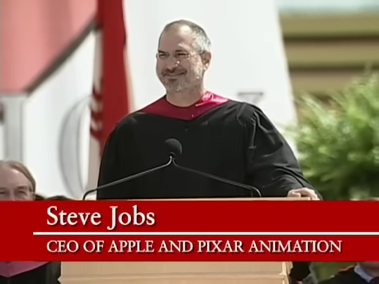

+++
date = '2025-05-26T15:47:10+08:00'
draft = false
title = "Keep looking, don't Settle"
[[resources]]
  name = 'jobs'
  src = 'images/jobs.png'
+++

标题这句话出自 Jobs 在斯坦福毕业典礼上的演讲，我觉得在此用作这个时隔多年重启的博客的第一篇文章的标题非常合适。

多年以前，在某处看过这个演讲，但那时感触并不深。现在把演讲视频在B站上找出来重看了一遍，才发现 Jobs 对于我的影响是多么巨大。

我想在此挑出演讲中的一些段落，放在这篇文章里，在这个无人问津的角落，用以自勉，并时刻提醒自己，不忘初心。

Jobs 在演讲里讲述了三个发生在他身上的故事，每个故事都围绕一个主题。

## 1st Story: connect the dots

> I had no idea what I wanted to do with my life, and no idea how college was going to help me figure it out. And here I was spending all of the money my parents had saved their entire life. So I decided to drop out and trust that it would all work out OK. It was pretty scary at that time. But looking back, it was one of the best decisions I ever made. The minute I dropped out, I could stop taking the required classes that didn't interest me and begin dropping in on the ones that looked far more interesting.

Jobs从大学退学，一个很重要的原因是因为Reed College昂贵的学费，花掉了他养父母毕生的积蓄。Jobs的养父母都是工人阶级，家境并不富裕。所以Jobs说自己天真的（naivly）选择了里德学院。Jobs选择退学的时候也很惶恐（scary），也许也包含对未来的迷茫。多年以后再回过头看，才知道这是他做过的最棒的决定之一。

谁成想中途辍学创业后来竟成了佳话和硅谷风潮，假如Jobs在一个富裕的中产家庭，父母完全供得起他读完大学，他还会选择辍学吗。

> None of this had even a hope of any practical application in my life. But ten years later, when we were designing the first Macintosh computer, it all came back to me. And we designed it all into the Mac. It was the frist computer with beautiful typography.

这里是说他辍学后去旁听了里德学院的书法课（calligraphy instruction），当时完全想不到这会对他的生活产生什么实质性的帮助。但是十年后，当他设计第一台Mac时，过去这些经历全部浮现了出来，他们把这些全部设计进了Mac里。所以Mac成为了第一台拥有漂亮字体的电脑。

> Again, you can't connect the dots looking forward, you can only connect them looking backwards. So you have to trust the dots will somehow connect in your future. You have to trust in something. Your gut, destiny, life, karma, whatever. Because believing the dots will connect down the road will give you the confidence to follow your heart even when it lead you off the well-worn path. And that will make all the difference.

你没办法知道你当下做的事情在未来会产生怎样的连结（connect the dots），只有当你回望时，才能把这些看似无关的经历给联系起来。你没法预见未来，所以你只能选择相信，相信你的胆识、你的宿命，你的生活，你的命运。只有相信当下的经历在之后的人生旅途中必定会产生连结，你才有信心和勇气去遵从自己的内心（**follow your heart**），即便她把你指向一条小径、岔路。结果会很不一样。

Jobs的这个理念对我的潜在影响就是，当我做一件事时，不会过多的从功利的角度去考虑这件事能带给我的收益，只要我感兴趣，我就会去做。选择读哪本书是这样，看任何一部电影也是这样，听音乐、弹琴也是这样，做投资时也是这样，学日语时也是这样。作为一个理科生，却对文字非常敏感，喜欢读文学著作，这多少有点不一样。你要说读马尔克斯、读村上春树、读石黑一雄、读菲茨杰拉德对生活对工作有什么实质影响，实在说不上，也许让我成为一个内心更细腻的人，但这又有什么用呢。我就是喜欢，所以我就去读，读的过程中内心有所触动，这就够了。

## 2nd Story：Love and Lose

> I didn't see it then but it turned out that getting fired from Apple was the best thing that could have ever happened to me. The heaviness of being successful was replaced by the lightness of being a beginner again, less sure about everything.

三十岁的时候被赶出了自己亲手创立的公司，当时Jobs并不知道这对他来说其实是件好事。（苹果的）成功的沉重被成为初心者的轻盈所取代，不再对任何事都感到理所应当。

这里的 **heaviness** 和 **lightness** 让我想到米兰昆德拉《生命不能承受之轻》里关于重和轻的阐释。

> I'm pretty sure none of this would have happened if I hadn't been fired from Apple. It was awful tasting medicine, but I guess the patient needed it. Sometimes life hits you in the head with a brick. Don't lose faith. I'm convinced that the only thing that kept me going was that I loved what I did. You've got to find what you love. And that is as true for your work as it is for your lovers.

这里Jobs说假如没有在他30岁时被赶出Apple这件事，也就不会有他后来创立NeXT和Pixar这些事。良药苦口，但（当时的）我需要它。
有时生活会给你当头一棒，不要失去信念。我坚信，唯一支撑我走下去的，是我热爱我做的事。你一定要找到你所热爱的，不管是工作也好，爱人也罢，一定要找到你爱的。

> Your work is going to fill a large part of your life, and the only way to be truly satisfied is to do what you believe is great work. And the only way to do great work is to love what you do. If you haven't found it yet, keep looking, and don't settle.

你的工作会占据你生活的绝大部分，唯一能让你真正感到满足的，就是去做真正great的工作。做great的工作的唯一方式，是热爱你所做的事。如果你还没找到它，**继续找，不要将就**。

这里我不知道如何恰当地翻译「great work」，「伟大的工作」似乎过于沉重了，大部分人的工作都是微小，不值得称道的，你能因此就否定他们工作的意义吗。美国人似乎很喜欢用great、amazing、wonderful这类在中文语境下的「大词」，我觉得这里Jobs想表达的，是有意义的工作、不平庸的工作，对应「ordinary work」。

## 3rd Story: Death

> When I was 17, I read a quote that went something like "If you live each day as if it was your last, someday you'll most certainly be right". It made an impression on me and since then for the past 33 years, I have looked in the mirror every morning and asked myself "If today was the last day of my life, would I want to do what I am about to do today?". And whenever the answer has been "No" for too many days in a row. I know I need to change something.

当我17岁时，我读到一句话，大意是「如果你把每天都当作你生命中的最后一天来过，那么总有一天你会发现你是对的」。这句话让我印象深刻，并且自那之后的33年里，我每天早晨都面对镜子，问自己：「如果今天是你生命中的最后一天，你还会想做你本来要做的事吗？」如果答案连续很多天都是「不」，我便知道我需要改变了。

Jobs 的这段话太过remarkble，以至于几乎任何人都知道。但是知道需要改变，和真正做出改变，之间是有着巨大的鸿沟的。因为跨越鸿沟需要足够的勇气，稍有不慎，可能坠入悬崖，后果严重，所以大多数人只会站在崖边驻足、观望，等待身边出现一个跃出的人，伸过头看他的下场。今年三月份的时候，我终于鼓足勇气，提了离职，因为之前那份工作不是我真正想做的工作，我感受不到工作的意义。我不知道我还要花上多久，才能找到下一份工作，也不知道下一份工作是否就是我想做的工作，我只知道眼下需要改变，况且我已经驻足观望并且忍受足够久了。

> Remebering that I'll be dead soon is the most important tool I've ever encountered to help me make the big choices in life. Because almost everything, all external expectations, all pride, all fear of embarrassment of failure, these things just fall away in the face of death, leaving only what is truly important. Remembering that you are going to die is the best way I know to avoid the trap of thinking you have something to lose. You are already naked, there is no reason not to follow your heart.

谨记我将很快死去，对我做出人生中的重大抉择，有很大的帮助。因为几乎所有东西，所有外部的期望，所有骄傲，以及对于伴随失败而来的窘迫的恐惧，所有这些，都会在死亡面前烟消云散，只留下真正重要的东西。记住人终有一死，是避免患得患失的最好的方式。你本来一无所有，没有理由不遵从自己的内心。

> Your time is limited, so don't waste it living someone else's life. Don't be trapped by dogma, which is living with the results of other people's thinking. Don't let the noise of others' opinions drown out your own inner voice. And most important, have the courage to follow your heart and intuition. They somehow already know what you truly want to become. Everything else is secondary.

这里Jobs 讲述了自己被诊断为胰腺癌，被医生告知只有不到六个月的生存期，随后发现这种癌症是一种罕见的可以通过手术摘除的类型，于是他便做了手术，恢复了健康（当时他还并不知道后面会复发）。他说这是他最接近死亡的一次，并由此引出上面这段话：

你的时间是有限的，不要浪费时间去过别人的生活。不要被教条所束缚，不要让外界的噪音淹没你内心的声音。最重要的，勇敢地追随你的内心和直觉。他们知道你真正想成为的人。其他一切都是次要的。

## End of Story

最后，我想用尼采在《查拉图斯特拉如是说》里的一句话作为这篇文章的结尾。

> 我爱那些不知道怎么生活的人，他们只知道做个没落的人，因为他们是向彼处过渡者。

最后的最后，让我们再次缅怀Jobs。(End)
